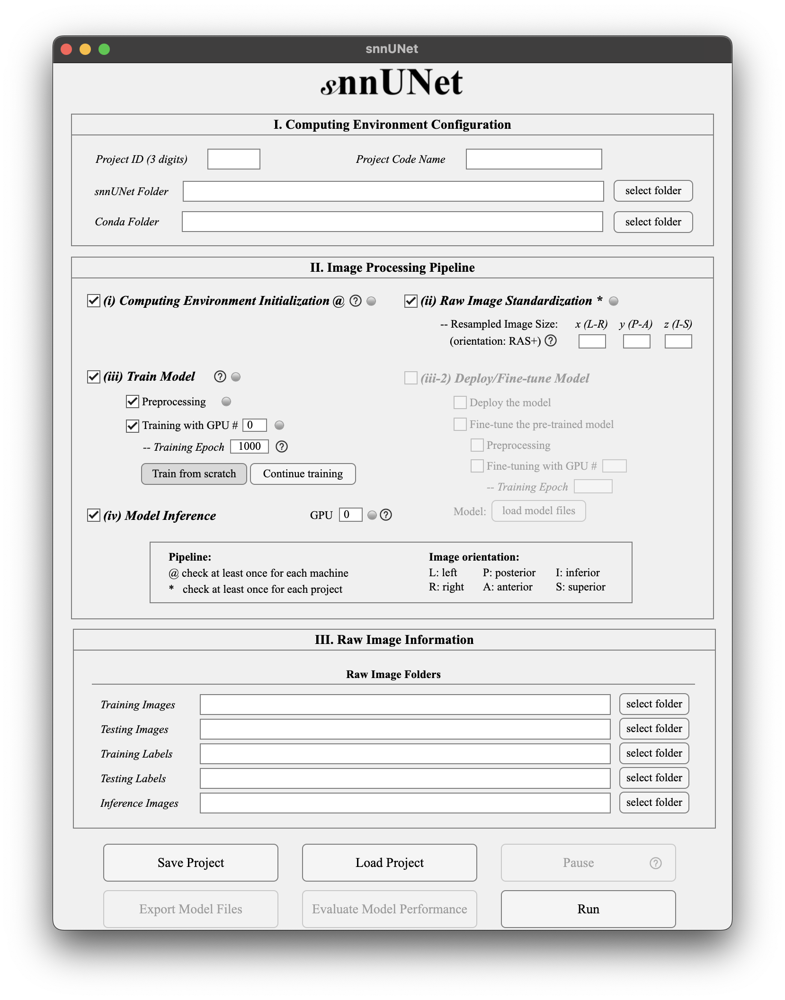

# Step-by-step Instructions

## Graphical User Interface

**Hints: Hover on the question marks for tips.**

## I. Computing Environment Configuration

- `Project ID (3 digits)`: a **unique** 3-digit string as project ID – you can not have same IDs within the `snnUNet Folder`
- `Project Code Name`: an alias for the current project
- `snnUNet Folder`: the output folder – any folder for the preprocecssed images,  trained models, and model predictions
- `Conda Folder`: the **root folder** of Anaconda or Miniconda, such as `/some/path/to/miniconda3` or `/some/path/to/anaconda3`

## II. Image Processing Pipeline

- `(i) Computing Environment Initialization`: it will create a virtual environment `CartiMorphToolbox-nnUNet` and install [CartiMorph-nnUNet](https://github.com/YongchengYAO/CartiMorph-nnUNet)
- `(ii) Raw Image Standardization`: all images will be reoriented to the RAS+ orientation, and resampled to `[x, y, z]`
  - `x (L-R)`: the size of the first dimension of the standardised image – corresponding to the left-**R**ight direction
  - `y (P-A)`: the size of the second dimension of the standardised image – corresponding to the posterior-**A**nterior direction
  - `z (I-S)`: the size of the third dimension of the standardised image – corresponding to the inferior-**S**uperior direction
- `(iii) Train Model`: this toolkit will preprocess images and train a 3D full-resolution nnUNet model with the specified GPU and training epoch
  - `Training Epoch`: this is the <u>total training epoch</u>
  - `Train from scratch`: train a new model from the beginning
  - `Continue training`: resume model training from where you leave off
- **Uncheck (iii) to enable (iii-2) and vice versa**
- `(iii-2) Deploy/Fine-tune Model`: the toolkit will load the model and set the image size in `(ii)` automatically
  - `Training Epoch`: this is the <u>total fine-tuning epoch</u>
  - `load model files`: select the <u>model folder</u> that was generated by the `Export Model Files` button
- `(iv) Model Inference`: segmentation model prediction

## III. Raw Image Information

- `Training Images`: folder of images for model training
- `Testing Images`:  folder of images for model evaluation
- `Training Labels`: folder of segmentation labels for model training
- `Testing Labels`: folder of segmentation labels for model evaluation
- `Inference Images`: folder of images for model inference

## IV. Buttons

- `Save Project`: save the current project configuration and status

- `Load Project`: load previoud project from a configuration file

- `Pause/Resume`: pause or resume the pipeline

- `Export Model Files`: save model and related configuration files into a <u>model folder</u>, which can be loaded in `(iii-2)` for model depolyment and fine-tuning

- `Evaluate Model Performance`: evaluate segmentation performance with Dice Similarity Coefficient (DSC)

- `Run`: start the pipeline

  

[<<< Back to the main document](https://github.com/YongchengYAO/snnUNet/tree/main)
