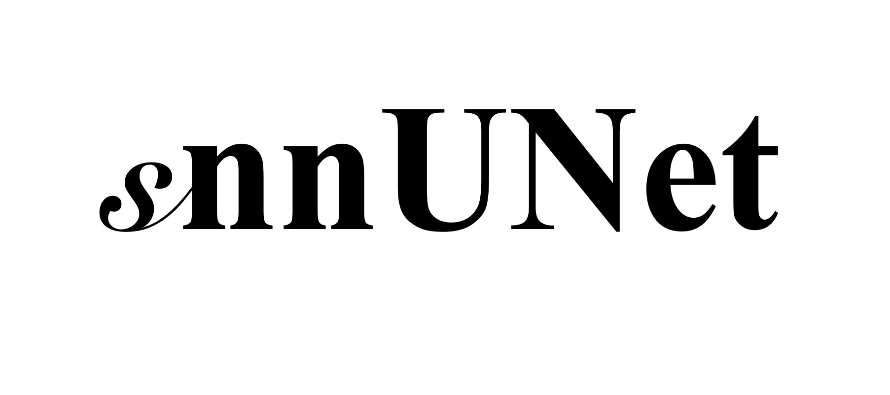

<div style="text-align:center">  </div>

[Python: 3.10] [Matlab: 2022b]

## Introduction

**snnUNet** is an interface for the training, fine-tuning, evaluation, and inference of [nnUNet (v1)](https://github.com/MIC-DKFZ/nnUNet/tree/nnunetv1). It is part of the [**CartiMorph Toolbox**](https://github.com/YongchengYAO/CartiMorph-Toolbox) and the [**CartiMorph**](https://github.com/YongchengYAO/CartiMorph) project. If you use **snnUNet**, please cite the CartiMorph and nnUNet paper.

```
@article{yao2024cartimorph,
  title={CartiMorph: A framework for automated knee articular cartilage morphometrics},
  author={Yao, Yongcheng and Zhong, Junru and Zhang, Liping and Khan, Sheheryar and Chen, Weitian},
  journal={Medical Image Analysis},
  volume={91},
  pages={103035},
  year={2024},
  publisher={Elsevier}
}
```

> Isensee F, Jaeger PF, Kohl SA, Petersen J, Maier-Hein KH. nnU-Net: a self-configuring method for deep learning-based biomedical image segmentation. Nature methods. 2021 Feb;18(2):203-11.

## Quick Start

1. Install Conda (Anaconda or Miniconda)
2. Install [snnUNet](https://github.com/YongchengYAO/snnUNet/releases)
3. Launch snnUNet for model training, fine-tuning, evaluation, and inference

## Features

- Auto-configuration of the computing environment
- Automatic image standardization (reorientation & resampling)
- Model training, fine-tuning, evaluation, and inference (only support 3D full-resolution nnUNet)
- Model loading and exportation for easy model sharing

## Step-by-step Instructions

For detailed instructions, please go to [this page](https://github.com/YongchengYAO/snnUNet/blob/main/Documents/instructions.md).

## Known Issues

For some currently identified issues, go to [this page](https://github.com/YongchengYAO/snnUNet/blob/main/Documents/knownIssues.md).

## FAQ

For some frequently asked questions, please go to the [FAQ page](https://github.com/YongchengYAO/snnUNet/blob/main/Documents/FAQ.md).

## Acknowledgement

- Our work is based on the [nnUNet (v1)](https://github.com/MIC-DKFZ/nnUNet/tree/nnunetv1)
- We implemented nnUNet using [CartiMorph-nnUNet](https://github.com/YongchengYAO/CartiMorph-nnUNet)

